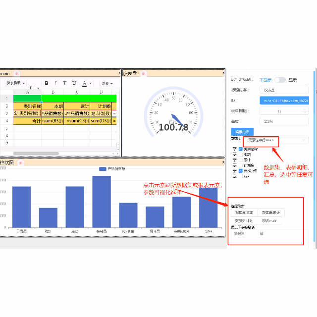

# 介绍

CellReport 是一个以 复杂统计报表 为核心目标的制作、运行工具。你可以使用数据库、excel文件、api服务、已有报表等为数据源，通过内置的集合函数组织数据，以类excel界面设计最终呈现结果。

CellReport 诞生的初衷是为了解决日常快速制作统计报表的需要。在总结了市面上各种报表软件的前提下，结合集合运算的思想，使得报表制作人员抛弃使用存储过程加工数据的方式，专注于每一类指标的加工，然后在报表设计界面，通过集合函数组织数据，极大得方便了报表的制作和维护。

 | 源码 | 文档 | 发行版 |
 | ------ | -------- | ------ |
 | [Github](https://github.com/noneday/CellReport)| [Github在线文档](https://noneday.github.io/CellReport) | [github下载](https://github.com/NoneDay/CellReport/releases/tag/1.0.2)  |
 | [Gitee](https://gitee.com/noneday/CellReport)| [Gitee在线文档](https://noneday.gitee.io/CellReport) | [gitee下载](https://gitee.com/NoneDay/CellReport/releases/1.0.2)  |
 


## 主要特点：
- 支持所有常规的清单、分组、交叉。
- 多源、分片
- **多数据集的集合运算**
- **单元格扩展、引用**
- **内置类js语言引擎**
- 丰富的函数定义
- 可自定义扩展函数
- 页面元素丰富。预定义有报表组件、echart组件、数据展现组件等
- 灵活的报表元素间的数据引用，局部报表刷新设置方便
- 组件报表引用、以及对其他报表软件制作的报表引用（专业版提供）


 
## 技术实现
前端设计器采用基于vue、luckysheet、echarts等前端技术实现的网页方式
后端报表引擎核心基于netcore6 实现

## 它是如何工作的？

报表运行时，会首先以并行方式将所有数据集的数据取到运行环境，然后根据报表设计中预定义好的公式做数据的合并、运算，最终数据以json方式传给最终展现页面，前端页面根据json结果呈现最终展示。

报表运行环境内置了类js语言环境，所有运算都是以该语言为核心。通常制作报表，我们只需要记住10个左右的函数，以及+-*/ ，就足够我们制作复杂的统计报表了。

运行环境提供了很多可以拦截接入自定义控制的地方，如：报表运行前的通用检查、控制数据集的数据是否回传前端等。前端展现可以动态插入自定义css、js 。

前端是以vue 为基础，通过template-compiler模板编译器，可自由控制echart、数据展现等组件的显示样式。

后端运行的基础环境是net6。内存效率利用极高，仅需300M左右内存。内部大量异步任务和延迟返回等技术，执行效率基本和原生手写加工数据程序的运行效率相当。

我们可以通过实现FunctionUnit接口实现系统没有预定义的函数，也可以用内置语言实现一些简单的函数扩展。

## 需要安装的软件
1. 下载安装NET6 SDK6 或 ASP.NET Core Runtime 6. [Download .NET (Linux, macOS, and Windows)](https://dotnet.microsoft.com/en-us/download/dotnet/6.0)
2. 下载安装redis（可选）。最好安装 [https://github.com/MicrosoftArchive/redis/releases](https://github.com/MicrosoftArchive/redis/releases)
3. [github下载release](https://github.com/NoneDay/CellReport/releases/) 。

## 运行和配置
假设解压安装到了d:\cellReport。
1. 执行 start.bat
2. 浏览器输入地址:  http://127.0.0.1:5000
3. 缺省用户名密码:admin/database!123 。管理员用户在appsetting.json中存有（最后面可以找到），可以自行修改。

### 报表组管理
 缺省已经有了一个default组和example组。第一次登录，选报表组管理做基本的配置报表存放路径和数据库链接。可以根据不同的应用建立不同的组。报表组可以添加协助管理人员，多个用户中间用英文逗号分割。
 
 当前预安装的数据库驱动程序有:sqlServer、sqlite、Mysql、Pgsql、odbc。需要其他驱动的自行下载安装。


```
sql server 连接串格式
Data Source=ip地址;Initial Catalog=数据库名字;Persist Security Info=True;User ID=用户;Password=口令;Min Pool Size=1;Max Pool Size=50;Connect Timeout=15000;Application Name=报表连接

oracle 连接串 格式
Data Source=(DESCRIPTION=(ADDRESS=(PROTOCOL=TCP)(HOST=ip地址)(PORT=端口))(CONNECT_DATA=(SERVER = SERVER名字)(SERVICE_NAME = 数据库)));User Id=用户;Password=口令;

sqlite 连接串 格式
Data Source=E:\my_app\报表源码_2020\a_new_lib\test.db

MySql 连接串 格式
Database=dbname;Data Source=x.x.x.x;Port=3306;User Id=xxx;Password=****;Charset=utf8;TreatTinyAsBoolean=false;
```

配置完毕后，按F5 刷新页面，点报表目录，正常的话，这是应该能看到所有的测试报表了

## 报表交流qq群 860056080

## 本软件使用到的的第三方软件，在此一并致谢
前端： [luckysheet](https://github.com/mengshukeji/Luckysheet) ，vue ，element-ui, [avuejs](http://avuejs.com)
后端: antlr3
